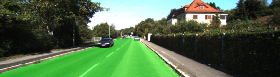
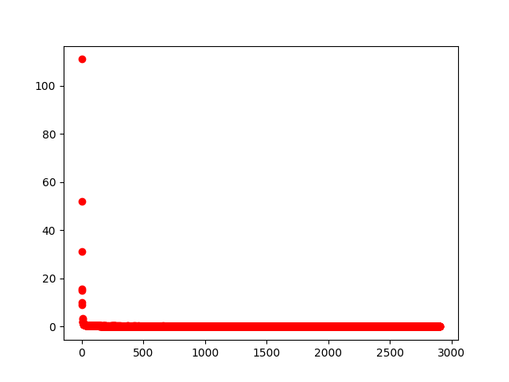

# Semantic Segmentation
### Introduction
In this project, I label the pixels of a road in images using a Fully Convolutional Network (FCN).

### Setup
##### Frameworks and Packages
I used the community ami `udacity-carnd-advanced-deep-learning - ami-3e6c7547`, update of all packages and h\
ad to re-install `tensorflow-gpu`.
I had to add the package `tqdm`.

The one problem I had was that the first virtial machine I used was one with the K520 processor. This had to\
 little memory so I had to switch to a machine with a tesla k80 processor.

##### Dataset
I downloaded the [Kitti Road dataset](http://www.cvlibs.net/datasets/kitti/eval_road.php).

### Implementation
I saw the project walkthrough video with Aaron and Brok, and my implementations follow the template provided\
 in the video.

All my code is in the `main.py` file indicated by the "TODO" comments.
I did not do the "OPTIONAL" tasks.

<s>I ended out with 60 Epochs and a batch size of 32.</s>

#### Additional comments in second hand-in:
I added an kernel initializer in the `layers` function. I experimented both with `tf.contrib.layers.xavier_initializer` and `tf.truncated_normal_initializer`, and found best results using the latter with a standard deviation value of 0.01.

I changed the number of `epochs` and the `batch size` after the reviewers comments, using an epoch value of 30 and batch size 3. 

I experiemented with the `keep probabilty` and `learning rate`, ended up with a keep_probability of 0.75 and learning rate of 0.0001. The loss vs epoch during the calulation is shown below:   

